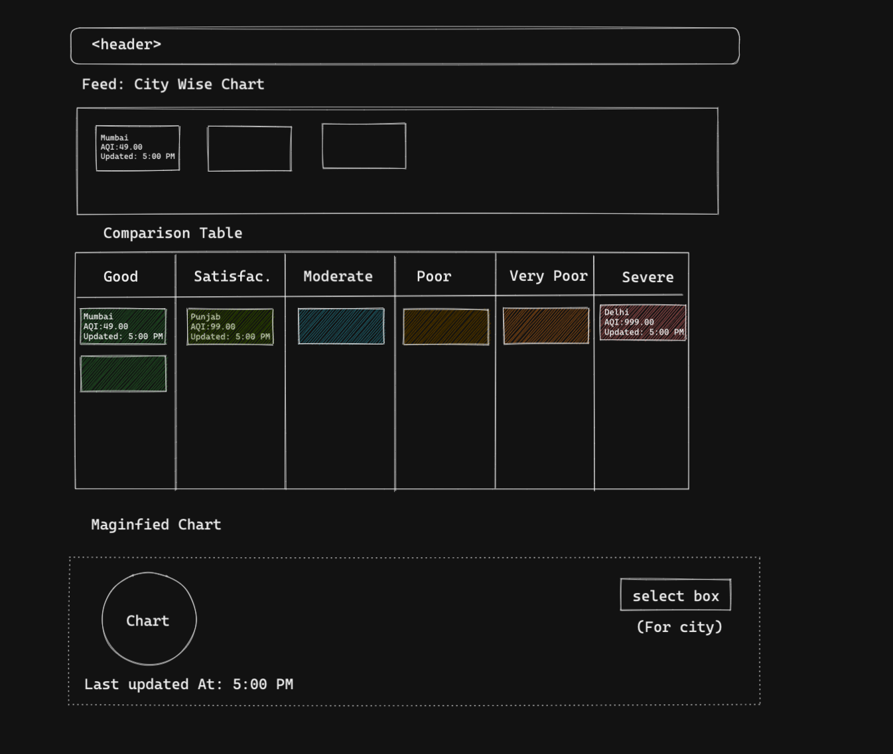

# AQI Monitoring
- AQI Monitoring tool. Data based on socket connection.
- This project was bootstrapped with [Create React App](https://github.com/facebook/create-react-app).

## Requirements
- Live City wise AQI Chart (Air Quality Index)
- AQI highlighted by different colors based on level
- Comparison of AQI of different cities
- Magnified Chart of Live AQI of only one city.

## Wireframe

## UI Inspirations
- [Dribble](https://dribbble.com/shots/14347675-Live-Air-by-Kaiterra-app-interface/attachments/6012626?mode=media)

## Features
- City wise visualisation chart
- Live AQI data feed.
- AQI Comparison table

## Assumptions
- Default cities & AQI range.
- Active socket connection. 

## Timeline
- Wireframing + Design ~ 30mins
- Scaffolding ~ 15mins
- Socket connection ~ 30mins
- City wise visualisation chart ~ 40mins
- Live AQI data feed ~ 30mins
- Comparison Table ~ 30mins
- ReadMe + Deployment + Submission ~ 40mins

## Libraries & Third party support
- ReactJs
- [React D3 Speedometer](https://www.npmjs.com/package/react-d3-speedometer)
- Deployment - 
- Excalidraw for Wireframing. 
- GitHub

## Misses & Possible enhancements 
- CSS pre-processors like SCSS (leverage mixins, variables, etc.)
- React with Typescript
- Unit tests.
- Improved DevX.

## Local Development

In the project directory, you can run:

### `yarn start`

Runs the app in the development mode.\
Open [http://localhost:3000](http://localhost:3000) to view it in the browser.

The page will reload if you make edits.\
You will also see any lint errors in the console.